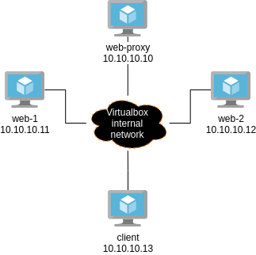

# DevSecOps Workshops: NGINX Proxy

This is a brief documentation of NGINX, followed by a workshop. For the workshop material, visit <a href="https://github.com/mdnfiras/devsecops-nginx-proxy" target="_blank">github.com/mdnfiras/devsecops-nginx-proxy</a>. For a complete documentation, visit <a href="https://nginx.org/en/docs/" target="_blank">nginx.org/en/docs</a>.

## What is NGINX?

NGINX, is a web server that can also be used as a reverse proxy, load balancer, mail proxy, HTTP cache and many more. Visit <a href="https://docs.nginx.com" target="_blank">docs.nginx.com</a> for a better understanding of NGINX products. In this workshop we'll be using NGINX Open Source: The open source all-in-one load balancer, content cache, and web server.

## Start using NGINX

In this workshop, the NGINX setup is performed inside Vagrant VMs. In this workshop we will try to implement the following architecture:



The Vagrantfile in the material folder contains the VMs definition and can be run using `vagrant up --provider virtualbox`, which brings up the VMs and the required network configuration or a similar one. It is better to always check up the networking configuration of each VM after issuing `vagrant ssh vm-hostname` by running `ip addr` from within the VM. The rest of the configuration is provided in bash scripts but is not automatically set up. I advise students not to copy paste them, and try to finish the workshop on their own, then use the provided scripts for verification.

### Launching Vagrant machines

In this workshop, 3 Vagrant VMs will consume 512 MB of RAM and will use 1 vCPU (total of 1.5 GB and 3 vCPUs). Run the following commands from within the `material` folder to start the Vagrant VMs:

```bash
vagrant up --provider virtualbox
```

You can ssh into any of the VMs for example by running:

```bash
vagrant ssh web-1
```

### Installing NGINX and running a web server

Since we're using a Ubuntu server 20.04 Vagrant Box, installing NGINX is as simple as:

```bash
sudo apt update
sudo apt install -y nginx
```

You can check the NGINX service by running:

```bash
sudo service nginx status
```

If you're on the `web-1` VM, you can run `curl 10.10.10.11` to view the web page. The NGINX service is aleady running and serving a default web page.

Modify the content of `/var/www/html/index.html` from within the `web-1` VM to display other content, then try `curl` again. Also, create a file `/var/www/html/web-1.html` with unique content of your choice. Verify by using `curl 10.10.10.11/web-1.html`.

Perform this same setup on the `web-2` VM, (its IP address is `10.10.10.12`). Make sure to display different content on the web pages.

### Installing NGINX and running a reverse proxy

Next, ssh into the third VM `web-proxy` and install NGINX the same way. The service will automatically start serving the default web page as ususal. The `web-proxy` VM should be using `10.10.10.10` IP address. Verify by running `curl 10.10.10.10` from within the `web-proxy` VM. Don't bother chaning the content of the HTML.

Next, ssh into the `client` VM. Modify the `hosts` file `/etc/hosts` and add these two lines at the end:

```
10.10.10.10 web-1.com
10.10.10.10 web-2.com
```

This way, we're instructing the `client` VM to resolve `web-1.com` and `web-2.com` to the same private IP of the `web-proxy` VM, without having to rely on an external DNS. Run `curl web-1.com` and `curl web-2.com` to visit both domain names to confirm the setup. Both should display the default web page of the `web-proxy` VM. `curl web-1/com/web-1.html` should return `404 not found`.

Next, from within the `web-proxy` VM, display the content of `/etc/nginx/nginx.conf` and figure out which configuration section instructs NGINX to serve that default web page. Study it carefully (for you own learning :D) then remove it, since we'll be configuring this NGINX service to work as a reverse-proxy.

Finally, you have to configure NGINX service in the `web-proxy` VM to do the following:
<li>Listen on port 80 for http traffic.</li>
<li>When it receives http (80) requests from clients that used `web-1.com` domain name, it proxies their requests to `http://10.10.10.11`.</li>
<li>When it receives http (80) requests from clients that used `web-2.com` domain name, it proxies their requests to `http://10.10.10.12`.</li>

You can check your setup by running `curl web-1.com` (returns the `index.html` of `web-1` VM), `curl web-2.com`(returns the `index.html` of `web-2` VM), `curl web-1.com/web-1.html` (returns the `web-1.html` of `web-1` VM) and `curl web-1.com/web-2.html` (returns `404 not found`).

Start experimenting on your own. When you finish, you can take a look at the scripts provided in the `material` folder to verify you configuration.
